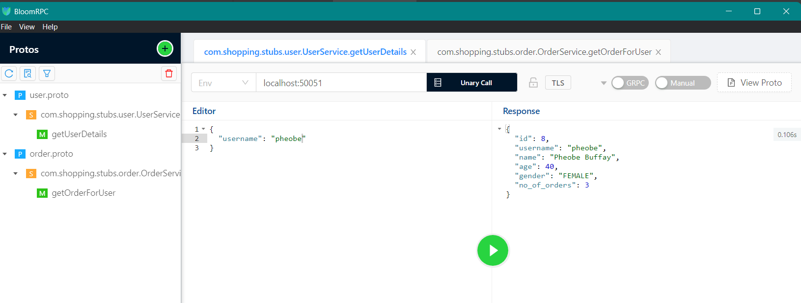
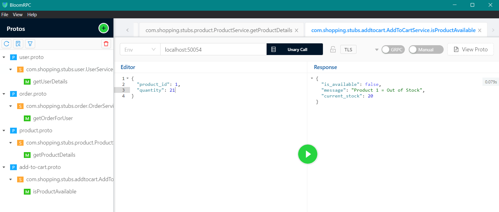

This project demonstrates how microservices communicate using **gRPC** in Java.

## Services

### Order Service (`localhost:50052`)
- Function: Returns a **list of orders** for a given user ID.

### User Service (`localhost:50051`)
- Function: Returns **user details** along with the **total number of orders** placed by the user.
- Internal Call: makes a gRPC call to the **Order Service** using a generated client stub.

### Product Service (`localhost:50053`)
- Returns product details **(ID, name, price, quantity in stock)** for a given product ID.

### Add to Cart Service (`localhost:50054`)
- Function: Accepts product ID and requested quantity.
- Internal Call: Makes a gRPC call to the **Product Service** to:
   - Check product availability
   - Return a message about the availability.
   - Return the available quantity.
---

## How to Run the Project

1. **Start both services** via your IDE:
   - Run the `main` method in the `OrderServer` class.
   - Run the `main` method in the `UserServer` class.
   - Run the `main` method in the `ProductServer` class.
   - Run the `main` method in the `AddToCartServer` class.

2. Confirm the services are listening on:
   - **Order Service** → `localhost:50052`
   - **User Service** → `localhost:50051`
   - **ProductServer** → `localhost:50053`
   - **AddToCartServer** → `localhost:50054`

3. **Open [BloomRPC](https://github.com/bloomrpc/bloomrpc/releases)** (or any gRPC testing tool).

4. **Import the `.proto` file** used in the project.

5. **Make a unary call** to:
   - the User Service at `localhost:50051`.
     
   - AddToCartService at `localhost:50054`.
     

